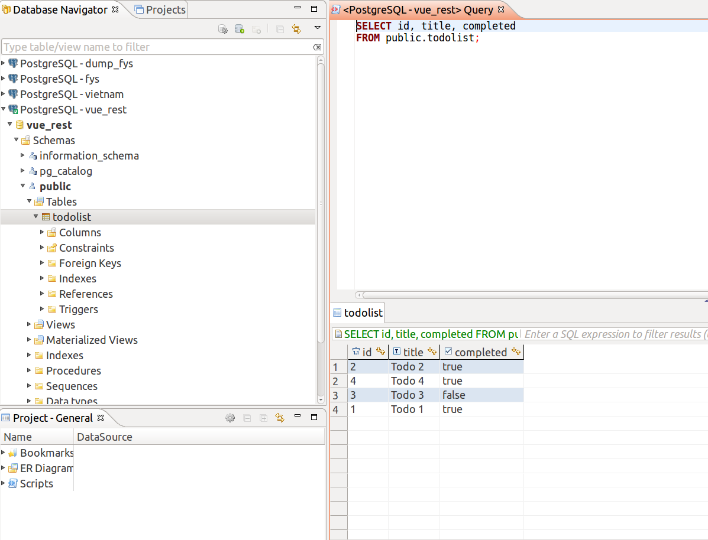
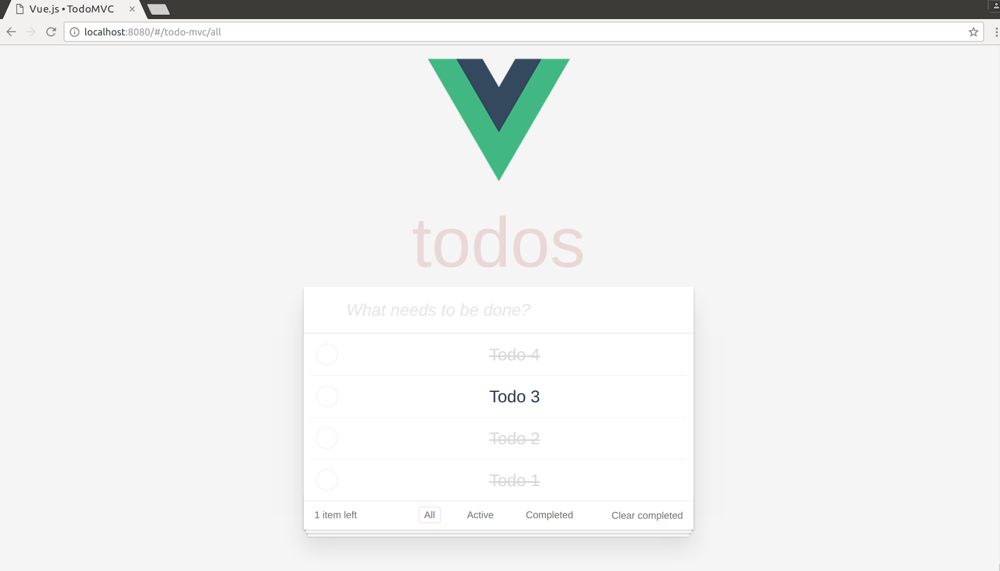

# vue-todo

> Vue TodoMVC demo with database and REST api  

## Database Setup

``` bash
$ git clone https://github.com/thanhdat21293/rest_api_todo_vue

$ cd rest_api_todo_vue

$ npm install
```

 - Bật PostgreSQL, tạo 1 cơ sở dữ liệu

 - Chỉnh sửa cấu hình theo cơ sở dữ liệu vừa tạo ở file `config/config.json`
 
 - Bật REST server:
 
``` bash
$ npm test 
$ node index.js
```

## Build Setup

 - Chỉnh sửa tất cả đường dẫn đến REST server đang chạy, mặc định là `http://localhost:3000` trong file `/src/components/Todo.vue`, ví dụ: 
 
 ```js
 ... 
 axios.get(`http://localhost:3000/api/todo-mvc/all)
 ... 
 ```

``` bash

$ cd Vue-TodoMVC

$ npm install

$ npm run dev

```

## Result 

- Database


- Vue app 


For detailed explanation on how things work, checkout the [guide](http://vuejs-templates.github.io/webpack/) and [docs for vue-loader](http://vuejs.github.io/vue-loader).

# REST api with ExpressJS

> Project rest_api_todo_vue có mục đích cung cấp một server chứa cơ sở dữ liệu (CSDL) với bảng todolist... và các REST api làm việc với chúng 

### Cấu trúc chính 
```
 rest_api_todo_vue/
 --| config
 -----| config.json          // nơi khai báo các thông số để kết nối đến CSDL  
 --| migrations
 -----| 001.do.Todo.sql      // file sql chứa các câu lệnh tương tác với CSDL 
 --| test
 -----| 01_CreateTable.js    // file test để kiểm tra có kết nối được với CSDL được không
 --| index.js                // file khởi tạo server cùng các REST api 
 --| pgp.js                  // file khởi tạo pg-promise để kết nối ứng dụng node với PostgreSQL server 
 --| package.json            // file khai báo các thông tin cơ bản của ứng dụng, node module cần cài đặt...
 --|....

```

### pg-promise 

> Để tương tác được ứng dụng nodejs với CSDL PostgreSQL, ta cần một thư viện trung gian kết nối. pg-promise là một trong số đó.
 
Thiết lập kết nối đến CSDL
 
 - file `config/config.json`
```js 
{ //Ba môi trường làm việc
  "development": { 
    "username": "postgres",  // username và password để đăng nhập vào PostgreSQL 
    "password": "abc",
    "database": "vue_rest",  // tên CSDL 
    "host"    : "localhost", // địa chỉ ip, localhost tương ứng với 127.0.0.1 
    "port"    : 5432,        // cổng kết nối 
    "dialect" : "postgres",
    "schema"  : "public",    // tên schema chứa các bảng 
    "logging" : false
  },
  "test": {
    "username": "root",
    "password": null,
    "database": "database_test",
    "host"    : "payroll",
    "dialect" : "postgres"
  },
  "production": {
    "username": "root",
    "password": null,
    "database": "database_production",
    "host"    : "127.0.0.1",
    "dialect" : "postgres"
  }
}
```

 - `pgp.js` 
 Sử dụng module pg-promise, require các thông số từ `config/config.json` truyền vào biến cn và export ra để sử dụng 
 
 ```javascript
...
const config = require(path.join(__dirname, 'config', 'config.json'))[env];
... 
const cn = {
  host: config.host,
  port: config.port,
  database: config.database,
  user: config.username,
  password: config.password
};

... 
const pgp = require('pg-promise')(options);

module.exports.db = pgp(cn);
module.exports.config = config;
```
 
### EpxressJS 

- file `index.js`

Đây là file chạy chính cho phép ta bật một nodejs server, có khả năng kết nối đến CSDL nhờ sử dụng đến pg-promise ở file `pgp.js`

```javascript

const {db, } = require('./pgp');
const express = require('express');
... 

// sử dụng middleware bodyParser để xử lí dữ liệu thô, JSON, text, mã hóa URL... 
app.use (bodyParser.urlencoded ({
	extended: true
}));

```

Có 6 REST api tương ứng với các hành động đọc, thêm, sửa, xóa dữ liệu.

Dữ liệu trả về ở dạng json, nhằm phục vụ cho việc client-side rendering.

```javascript
app.use (bodyParser.json());
```

Cú pháp cho từng api có dạng tổng quát như sau, có thể kiểm tra riêng không cần giao diện với công cụ Postman:  
 ```bash 
    http://<địa chỉ ip>:<cổng kết nối>//<đường dẫn api>
 ```
```javascript
// Dùng phương thức GET 
app.get('/api/todo-mvc/all', (req, res) => {
    // gọi đến biến db làm việc với CSDL, thực thi câu lệnh sql 
    db.any('SELECT * FROM todolist ORDER BY id DESC')
    // đợi có kết quả
    .then((data) => {
        // trả lại dữ liệu dạng json 
        res.json(data)
    })
    // bắt lỗi nếu có 
    .catch(error => {
        console.log(error)
    });
});

// Dùng phương thức POST 
app.post('/api/todo-mvc/addTodo', (req, res) => {
    // truyền vào các tham số cần thiết cho câu lệnh sql 
    let title1 = req.body.title;
    let completed1 = req.body.completed;
    // method task được dùng để thực thi nhiều câu lệnh lồng nhau 
    db.task(t => {
        // "thêm mới dữ liệu vào bảng todolist", truyền vào tham số phía trên
        return t.any("INSERT INTO todolist(title, completed) VALUES($1, $2)", [title1, completed1])
            // sau khi thêm mới, liệt kê lại toàn bộ dữ liệu 
            .then(() => {
                return t.any('SELECT * FROM todolist ORDER BY id DESC');
            })
    })
    // trả về kiểu json 
    .then((data) => {
        res.json(data)
    })
    .catch(error => {
        console.log(error)
    });
});

// các hàm dưới cũng tương tự 
app.post('/api/todo-mvc/removeTodo', (req, res) => {
    ...
});

app.post('/api/todo-mvc/editTodo', (req, res) => {
    ...
});

app.post('/api/todo-mvc/completeTodo', (req, res) => {
    ... 
});

app.post('/api/todo-mvc/removeCompleted', (req, res) => {
    ... 
});

// khai báo cổng chạy server, hiện lên trên màn hình console 
const port = 3000;
app.listen(port, () => {
    console.log('Ready for GET requests on http://localhost:' + port);
});

```

# Đổi Vue TodoMVC sang cấu trúc của Vuecli
> Tách thành `Todo` và `Footer` components

### Todo Component
- Route: `/todo-mvc/:status` với status là `all`, `active`, `completed`. Đổi từ thẻ `<a>` sang `<router-link>`

```js
// src/router/index.js
// khai báo route vào todo-mvc
import Todo from '@/components/Todo'
Vue.use(Router)

export default new Router({
  routes: [
    {
      path: '/',
      name: 'Hello',
      component: Hello
    },
    {
      path: '/todo-mvc/:status',
      name: 'Todo',
      component: Todo
    }
  ]
})
```

```html
// src/components/Todo.vue
<li><router-link :to="{name: 'Todo', params: {status: 'all'}}" :class="{ selected: visibility == 'all' }">All</router-link></li>
<li><router-link :to="{name: 'Todo', params: {status: 'active'}}" :class="{ selected: visibility == 'active' }">Active</router-link></li>
<li><router-link :to="{name: 'Todo', params: {status: 'completed'}}" :class="{ selected: visibility == 'completed' }">Completed</router-link></li>
```

- Vì tất cả các routes `/todo-mvc/:status` đều dùng chung components nên khi routes thay đổi vì component này cũng không đc render lại. Để theo dõi routes và hiển thị dữ liệu chính xác, ta có `watch` biến `$route`

# Vue-TodoMVC 

### Cấu trúc chính 

```
  Vue-TodoMVC/ 
  --| src 
  -----| assets // thư mục chứa các tài nguyên như ảnh...
  -----| components // thư mục chứa các file Vue components vai trò như các trang khác nhau của ứng dụng 
  -----| router
  ----------| index.js // file khai báo các route - đường dẫn trỏ đến các component nào 
  -----| App.vue // file Vue chính của ứng dụng, nơi sử dụng các Vue components
  -----| main.js // khởi tạo một Vue object có id được tạo trong trang html chính
  --| index.html // file html chính 
  --| package.json       // file khai báo các thông tin cơ bản của ứng dụng, node module cần cài đặt...
  
  ...
 
 ```
 
 ### Hoạt động 
 > Ở project này ta tập trung vào file `src/components/Todo.vue` 
 
 - file `App.vue ` :
  
  ```javascript 
  <template>
    <div id="app">
    ...
      <ul id="link_footer">
        <li v-for="item in links"> // vòng lặp for cho từng object element trong mảng 'links', gán tên biến là 'items'
          <router-link v-bind:to=item.link>{{ item.desc }}</router-link> // với mỗi object element, gán các key vào để lấy ra value 
        </li>
      </ul>
    </div>
  </template>
  
  <script>
    export default {
      name: 'app',
      data() {
        return {
        // mảng dữ liệu 'links' được dùng ở trên 
          links: [
            // mỗi object element chứa các thông tin khác nhau, chính là đường dẫn để gọi đến các trang khác 
            {
              link: '/',        // trỏ đến trang chủ
              desc: 'Hello World',
              done: true
            },
            {
              link: '/todo-mvc/all',  // trỏ đến trang '/todo-mvc/all', chính là trang Todo.vue được khai báo ở src/router/index.js 
              desc: 'Todo MVC',
              done: true
            },
          ]
        }
      },
    }
  </script>
  ...
  ```
  
- file `Todo.vue`

```html
<template>
  <div>
  <!-- các @keyup.enter, @click, @dbclick, @keyup.esc... gọi đến các hàm bên dưới ở phần <script> --> 
    <section class="todoapp">
      <header class="header">
        <h1>todos</h1>
        <input class="new-todo" autofocus autocomplete="off" placeholder="What needs to be done?" v-model="newTodo" @keyup.enter="addTodo">
      </header>
      <section class="main" v-show="todos.length" v-cloak>
        <input class="toggle-all" type="checkbox" v-model="allDone">
        <ul class="todo-list">
        <!-- vòng lặp for cho mảng filteredTodos -->
          <li v-for="todo in filteredTodos" class="todo" :key="todo.id" :class="{ completed: todo.completed, editing: todo == editedTodo }">
            <div class="view">
              <input class="toggle" type="checkbox" @click="completeTodo(todo)">
              <!-- Lấy giá trị của key 'title' thuộc object 'todo' gán cho label -->
              <label @dblclick="editTodo(todo)">{{ todo.title }}</label>
              <button class="destroy" @click="removeTodo(todo.id)"></button>
            </div>
            <input class="edit" type="text" v-model="todo.title" v-todo-focus="todo == editedTodo" @blur="doneEdit(todo)" @keyup.enter="doneEdit(todo)"
                   @keyup.esc="cancelEdit(todo)">
          </li>
        </ul>
      </section>
      <footer class="footer" v-show="todos.length" v-cloak>
        <span class="todo-count"><strong>{{ remaining }}</strong> {{ remaining | pluralize }} left</span>
        <ul class="filters">
        <!-- Đường dẫn được khai báo trong file 'router/index.js' có dạng ~/todo-mvc/:status -->
          <li>
            <router-link :to="{name: 'Todo', params: {status: 'all'}}" :class="{ selected: visibility == 'all' }">All</router-link>
          </li>
          <li>
            <router-link :to="{name: 'Todo', params: {status: 'active'}}" :class="{ selected: visibility == 'active' }">Active</router-link>
          </li>
          <li>
            <router-link :to="{name: 'Todo', params: {status: 'completed'}}" :class="{ selected: visibility == 'completed' }">Completed</router-link>
          </li>
        </ul>
        <button class="clear-completed" @click="removeCompleted" v-show="todos.length > remaining">Clear completed</button>
      </footer>
    </section>
    <todo-footer></todo-footer>
  </div>
</template>

```
```javascript
<script>
  ... 
  
  export default {

    // dữ liệu được khai báo lần đầu trước khi các hàm được thực hiện 
    data() {
      return {
        todos: [],
        newTodo: '',
        editedTodo: null,
        visibility: 'all',
        filters: null,
        user: '',
        showTodo: false
      }
    },
    created() {
      // visibility filters
      this.filters = {
        all: function (todos) {
          return todos
        },
        active: function (todos) {
          return todos.filter(function (todo) {
            return !todo.completed
          })
        },
        completed: function (todos) {
          return todos.filter(function (todo) {
            return todo.completed
          })
        }
      }
      // retrieve todo data from server
      axios.get(`http://localhost:3000/api/todo-mvc/all`)
        .then(res => {
          this.todos = res.data
          this.visibility = this.$route.params.status
        })
        .catch(error => {
          console.error(error)
        })
    },
    // watch todos change for localStorage persistence
    watch: {
      todos: {
        handler: function (todos) {}
      },
      '$route' (to, from) {
        console.log('Change route ', this.$route.params.status);
        this.visibility = this.$route.params.status;
      }
    },

    // computed properties http://vuejs.org/guide/computed.html
    computed: {
      filteredTodos: function () {
        return this.filters[this.visibility](this.todos)
      },
      remaining: function () {
        return this.filters
          .active(this.todos)
          .length
      },
      allDone: {
        get: function () {
          return this.remaining === 0
        },
        set: function (value) {
          this
            .todos
            .forEach(function (todo) {
              todo.completed = value
            })
        }
      }
    },
  
    ... 

    // methods that implement data logic. note there's no DOM manipulation here at
    // all.
    methods: {
      
      // hàm thêm 1 todoitem
      addTodo: function () {
        var value = this.newTodo && this
            .newTodo
            .trim()
        if (!value) {
          return
        }
        // axios gọi đến REST api ở server thực hiện truy vấn với CSDL
        axios.post('http://localhost:3000/api/todo-mvc/addTodo', {
          title: value,
          completed: false
        })
          .then(res => {
            // this.todos.push(res.data[0])
            this.todos = res.data  // nhận được dữ liệu gán vào biến data
            this.newTodo = ''
          })
          .catch(err => {
            console.log(err)
          })
      },

      removeTodo: function (id) {
        ... 
      },

      completeTodo: function (todo) {
        ... 
      },

      editTodo: function (todo) {
        ... 
      },

      doneEdit: function (todo) {
        ... 
      },

      cancelEdit: function (todo) {
        ... 
      },

      removeCompleted: function () {
        ... 
      }
    },

    // a custom directive to wait for the DOM to be updated before focusing on the
    // input field. http://vuejs.org/guide/custom-directive.html
    directives: {
      'todo-focus': function (el, binding) {
        if (binding.value) {
          el.focus()
        }
      }
    },
    components: {
      todoFooter: Footer
    }
  }

</script>

```
